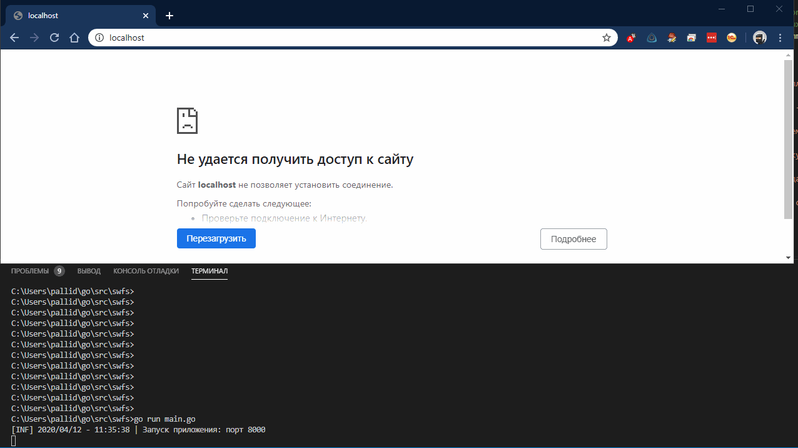

## Умный сервис прогноза погоды 

*(задача со сзвездочкой)*

- **Используемый язык**: golang
- **Пользовательский интерфейс**: сайт
- **Форма ответа**: текст
    - **Пример**:

        Данные об описание погоды и температуре полученные из API (openweathermap) представляются в текстовый шаблон "Местоположение, описание погоды, температура воздуха ___ ... ___"

- **Демонстрация**

    

- **Процесс работы программы**

     Данные приходят от пользователя через поле ввода на странице

    → формируется и отправляется запрос к API сервиса прогноза погоды

    → полученный ответ из сервиса используется для формирования ответа пользователю

    → ответ отображается на странице

- **Как запустить**
    - Напишите пошаговую инструкцию, как запустить вашу программу залив ее с гита. (если вы выполняете задачу с ботами вынесите все пароли и токены в отдельный файл и добавьте его в **.gitignore**)